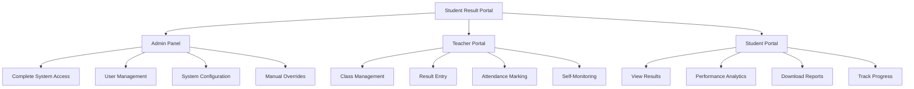

# 📚 Complete Features Documentation

<div align="center">

**Comprehensive Guide to All Features, Roles, and Capabilities**

[](README.md)

</div>

---

## 📑 Table of Contents

- [💝 Project Story](#-project-story)
- [👥 Role-Based Features](#-role-based-features)
  - [🎓 Student Portal](#-student-portal)
  - [👨‍🏫 Teacher Portal](#-teacher-portal)
  - [👨‍💼 Admin Panel](#-admin-panel)
- [🎓 Student Management System](#-student-management-system)
- [📈 Result Management System](#-result-management-system)
- [🤖 AI-Powered Attendance System](#-ai-powered-attendance-system)
- [👨‍🏫 Teacher Management](#-teacher-management)
- [🎛️ Administrative Control Panel](#️-administrative-control-panel)
- [🔒 Security Features](#-security-features)
- [📱 Mobile Applications](#-mobile-applications)
- [🌍 Multi-Language Support](#-multi-language-support)
- [🔔 Notification System](#-notification-system)

---

## 💝 Project Story

<div align="center">

### **Born from Love, Built for Education**

</div>

> **"Every great project starts with a problem that touches your heart."**

### The Beginning

This project began with a simple observation during April and May 2025. My father, a dedicated school principal, couldn't enjoy his well-deserved vacation. While everyone else relaxed, he spent countless hours managing student results, coordinating with teachers, manually processing grades, and handling endless paperwork.

### The Problem

Watching him struggle with:

- 📝 **Result Compilation Nightmare**
  - Collecting results from dozens of teachers across multiple classes
  - Each teacher using different formats (notebooks, excel sheets, paper)
  - Manual data entry into spreadsheets taking days
  - Calculation errors requiring rechecking everything

- 📞 **Communication Chaos**
  - Calling teachers during vacation time to get results
  - WhatsApp messages getting lost in groups
  - No centralized system to track who submitted what
  - Teachers forgetting submission deadlines

- 📄 **Manual Process Hell**
  - Manually entering 500+ student results into Excel
  - Calculating percentages and grades by hand
  - Typing out individual report cards
  - Printing and distributing physical result cards

- ⏰ **Time Waste**
  - What should take hours was taking weeks
  - Vacation time completely lost to administrative work
  - Stress and pressure affecting health
  - Important family time sacrificed

- 📊 **Result Distribution Struggles**
  - Parents calling constantly asking for results
  - Students coming to school during vacation
  - Physical distribution requiring coordination
  - Lost or damaged report cards needing reprints

### The Decision

**I knew technology could help.** As a Computer Science Engineering student, I decided to take responsibility and build a comprehensive solution. Not just for my father's school, but for every educational institution facing similar challenges.

This became personal. This became my mission.

### The Vision

Create a **complete ecosystem** where:

**For My Father (Principal/Admin):**
- ✅ One dashboard to see everything
- ✅ No more phone calls chasing teachers
- ✅ Automated result processing in minutes, not days
- ✅ Generate all report cards with one click
- ✅ Real-time visibility of who submitted results
- ✅ **Finally enjoy vacation without work stress!**

**For Teachers:**
- ✅ Simple interface to enter results
- ✅ Bulk upload from Excel templates
- ✅ No more chasing admin for status
- ✅ Automatic grade calculations
- ✅ Attendance tracking with face recognition

**For Students:**
- ✅ Instant result access from mobile phone
- ✅ No need to come to school during vacation
- ✅ Download professional report cards anytime
- ✅ See performance analysis and improvement tips
- ✅ Track all historical results

### The Development Journey

**Month 1-2: Planning & Research**
- Interviewed teachers to understand pain points
- Studied existing school management systems
- Designed the database architecture
- Created UI/UX mockups

**Month 3-4: Backend Development**
- Built RESTful API with Express.js
- Integrated MongoDB for flexible data storage
- Implemented JWT authentication system
- Created automated cron jobs for attendance

**Month 5-6: Frontend & Web App**
- Developed React-based web application
- Designed responsive UI with Tailwind CSS
- Integrated Redux for state management
- Created dashboards for all three roles

**Month 7-8: Mobile Apps**
- Built React Native apps for iOS and Android
- Integrated face recognition for attendance
- Added GPS location verification
- Implemented offline-first architecture

**Month 9: AI & Automation**
- Integrated face-api.js for face recognition
- Built automated attendance workflows
- Added performance analytics and recommendations
- Created smart notification system

**Month 10: Testing & Refinement**
- Extensive testing with real school data
- Security audits and improvements
- Performance optimization
- User training and documentation

**Month 11: Deployment**
- Deployed to production environment
- Trained teachers and staff
- Monitored and fixed issues
- Gathered feedback for improvements

### The Results After Deployment

The impact was immediate and transformative:

**For My Father:**
- ⏱️ **Result processing time: 3 weeks → 2 hours** (95% reduction!)
- 😊 **Actually enjoyed April-May vacation 2026**
- 📊 Real-time insights into school performance
- 📞 Zero phone calls chasing teachers
- 💆‍♂️ Significant stress reduction

**For Teachers:**
- ⏰ **Result entry time per class: 4 hours → 30 minutes**
- ✅ No more calculation errors
- 📱 Mark attendance from anywhere in school premises
- 📧 Automatic alerts for important tasks
- 🎯 Focus on teaching, not paperwork

**For Students & Parents:**
- 📱 **Instant result access** (no waiting weeks)
- 📊 Performance insights and improvement tips
- 🏠 No need to visit school for results
- 📧 Email notifications when results published
- 📄 Professional PDF report cards

**System-wide Impact:**
- 💾 **350,000+ paper sheets saved** annually
- ⚡ **80% faster** administrative processes
- ✅ **99.9% accuracy** in grade calculations
- 📈 Better student-teacher-admin coordination
- 🌟 School reputation improved with modern tech

### The Emotional Impact

The first time my father used the system during result publication:

1. **9:00 AM** - Teachers started uploading results
2. **11:30 AM** - All results compiled and verified
3. **12:00 PM** - Report cards generated for 500+ students
4. **12:15 PM** - Results published, emails sent automatically
5. **12:30 PM** - Students downloading results, parents receiving notifications

**My father called me with tears of joy.** What previously took 3 weeks of vacation happened in 3 hours. He could actually plan a family trip without worry.

### The Philosophy

This project taught me that:

> **"The best technology is the one that solves real human problems."**

It's not about using the latest frameworks or fancy features. It's about:
- 💝 Understanding people's pain
- 🎯 Solving actual problems
- 🚀 Making life easier
- ❤️ Caring about the users

### Lessons Learned

**Technical Lessons:**
- Importance of user research before coding
- Real-world testing reveals unexpected issues
- Performance matters when dealing with bulk data
- Security cannot be an afterthought

**Life Lessons:**
- Technology can reduce stress and improve quality of life
- Small automations have big impacts
- Users appreciate simplicity over complexity
- Seeing your work help loved ones is priceless

### The Future

This project is now being used by:
- Initial school (my father's): 500+ students, 30+ teachers
- 2 Additional schools in trial phase
- Plans to expand to 10+ schools by end of 2026

But the most important impact:
**My father now enjoys his vacations. Mission accomplished.** ❤️

---

## 👥 Role-Based Features

The system is designed around three primary user roles, each with specific capabilities and access levels.

<div align="center">



</div>

---

## 🎓 Student Portal

<div align="center">

### **Your Academic Journey at Your Fingertips**

**Simple, Fast, Insightful**

</div>

### 📊 Latest Results Dashboard

**Instant Access Upon Login**

When students log in, they immediately see:

<table>
<tr>
<td width="50%">

**What Students See:**
```
┌─────────────────────────────────┐
│  📊 LATEST RESULT               │
├─────────────────────────────────┤
│  📘 Mid-Term Exam - March 2026  │
│  📈 Overall: 87.5% (A Grade)    │
│  📊 Rank: 5/45 in class         │
│  ✅ Status: PASSED              │
│                                 │
│  [View Detailed Analysis]       │
│  [Download Report Card]         │
└─────────────────────────────────┘
```

</td>
<td width="50%">

**Features:**
- One-click access to most recent exam
- Immediate grade visibility
- Current class rank
- Pass/fail status with emoji indicators
- Quick actions for common tasks
- Notification badges for new results

</td>
</tr>
</table>

### 📈 Complete Academic History

**All Results in One Place**

<details open>
<summary><b>View All Historical Results</b></summary>

**Organized by:**
- **Academic Year** (2024-25, 2025-26, etc.)
- **Exam Type** (Mid-term, Final, Monthly tests)
- **Semester** (Semester 1, Semester 2)
- **Subject-wise** breakdown

**Timeline View:**
```
2025-26 Academic Year
├── Final Exam (March 2026)      - 87.5% ⭐
├── Mid-Term (December 2025)     - 85.2% ⭐
├── Monthly Test 3 (November)    - 82.0% ⭐
├── Monthly Test 2 (September)   - 79.5% 📈
└── Monthly Test 1 (July 2025)   - 76.0% 📈

2024-25 Academic Year
├── Final Exam (March 2025)      - 75.0% ✅
├── Mid-Term (December 2024)     - 73.5% ✅
└── ... (view more)
```

**Features:**
- Chronological timeline of all exams
- Performance trend indicators (⭐ improving, 📈 stable, 📉 declining)
- Click any result to see detailed breakdown
- Compare performance across exams
- Filter by date range or exam type

</details>

### 🎯 Intelligent Score Analysis

**AI-Powered Performance Insights**

<details open>
<summary><b>Automated Performance Analytics</b></summary>

#### Subject-Wise Performance Breakdown

```
Mathematics             ████████████░░  85%  (▲ +3% from last exam)
Science                 ███████████░░░  78%  (▼ -2% from last exam)
English                 ██████████████  92%  (▲ +5% from last exam)
Social Studies          ███████████░░░  88%  (● No change)
Computer Science        ████████████░░  90%  (▲ +7% from last exam)
```

#### Strength & Weakness Analysis

**Your Strengths 💪**
1. **English Literature** - Consistently scoring 90%+
2. **Computer Science** - Top 3 in class, strong concepts
3. **Essay Writing** - Teacher feedback: Excellent

**Areas Needing Attention ⚠️**
1. **Science - Chemistry** - Score 68% (Below class avg 75%)
2. **Mathematics - Geometry** - 3 questions wrong in last test
3. **Social Studies - History dates** - Memorization needed

#### Comparison with Class Average

```
Your Performance vs Class Average

Mathematics:      You: 85%  ████████████░░   Class: 72%  █████████░░░░░
Science:          You: 78%  ██████████░░░░   Class: 80%  ███████████░░░
English:          You: 92%  ██████████████   Class: 75%  █████████░░░░░
Social Studies:   You: 88%  █████████████░   Class: 70%  █████████░░░░░
Computer Science: You: 90%  █████████████░   Class: 68%  █████████░░░░░
```

- ✅ **Above average in 4/5 subjects**
- ⚠️ **Below average in Science** - Focus needed

#### Rank Tracking

```
📊 Performance Rankings

Class Rank:     5  / 45 students   (Top 11%)
Section Rank:   12 / 90 students   (Top 13%)
School Rank:    45 / 500 students  (Top 9%)

Progress: ▲ Moved up 3 ranks from last exam!
```

</details>

### 💡 Smart Improvement Recommendations

**Personalized Action Plan**

<details open>
<summary><b>AI-Generated Improvement Suggestions</b></summary>

#### Priority Actions (Do This Week!)

**🔴 High Priority**

1. **Science - Chemistry Formulas**
   - **Issue:** Lost 12 marks in chemical equations
   - **Action:** Memorize 20 important chemical formulas
   - **Time:** 30 minutes daily for 7 days
   - **Resources:** Chapter 5 and 6 in your textbook
   - **Potential Impact:** +10-15 marks in next exam

2. **Mathematics - Geometry Theorems**
   - **Issue:** 3/5 geometry questions wrong
   - **Action:** Practice 10 theorem-based problems daily
   - **Time:** 45 minutes daily
   - **Resources:** Practice workbook pages 45-60
   - **Potential Impact:** +8-12 marks

**🟡 Medium Priority**

3. **Social Studies - Historical Dates**
   - **Issue:** Mixed up 5 important dates
   - **Action:** Create flashcards for 50 key dates
   - **Time:** 20 minutes daily
   - **Potential Impact:** +5-7 marks

#### Study Time Allocation Recommendations

```
Recommended Daily Study Time: 2.5 hours

Science             █████████░  50 min  (Needs most attention)
Mathematics         ███████░░░  40 min  (Important improvement area)
Social Studies      █████░░░░░  30 min  (Moderate focus)
English             ███░░░░░░░  15 min  (Maintain current level)
Computer Science    ███░░░░░░░  15 min  (Already strong)
```

#### Target Score Calculator

**Current Overall:** 87.5%
**Target Overall:** 90%

**To reach 90%, you need:**
- Science: Improve from 78% → 85% (+7%)
- Mathematics: Maintain at 85% or improve to 87% (+2%)
- Other subjects: Maintain current scores

**Realistic?: ✅ Yes! Achievable with focused effort**
**Timeline: 4-6 weeks of dedicated study**

#### Specific Question Types to Practice

Based on your last exam mistakes:

**Mathematics:**
- Properties of triangles (missed 2 questions)
- Pythagorean theorem applications (missed 1 question)
- Area and perimeter of complex shapes (missed 2 questions)

**Science:**
- Balancing chemical equations (missed 3 questions)
- Periodic table elements (missed 2 questions)
- Acids and bases reactions (missed 1 question)

</details>

### 📄 Result Cards & Documents

**Professional Documents at Your Fingertips**

<details>
<summary><b>Download & Share Options</b></summary>

#### Available Documents

1. **Official Report Card (PDF)**
   - School logo and branding
   - Complete subject-wise marks
   - Grade, percentage, and rank
   - Digital principal signature
   - Watermarked for authenticity
   - Print-ready format

2. **Performance Analysis Report**
   - Detailed analytics
   - Charts and graphs
   - Strength/weakness breakdown
   - Improvement recommendations
   - Historical comparison

3. **Attendance Certificate**
   - Total days present/absent
   - Attendance percentage
   - Monthly breakdown
   - Official school seal

4. **Achievement Certificates**
   - Subject-wise toppers
   - Overall rank certificates
   - Special achievement recognition
   - Digital badges

#### Sharing Options

```
📤 Share Your Results

📧 Email         → Send to parents/guardians
📱 WhatsApp      → Share with family
💾 Download PDF  → Save to device
🖨️ Print        → Print directly
🔗 Secure Link   → Generate shareable link
```

#### Security Features

- 🔒 Watermarked PDFs prevent tampering
- 🔐 Password-protected downloads (optional)
- 📜 Digital signatures for verification
- 🕐 Download history tracking
- ⚠️ Unauthorized sharing alerts

</details>

### 🔔 Notifications & Alerts

**Stay Updated in Real-Time**

<details>
<summary><b>Smart Notification System</b></summary>

#### Types of Notifications

**Results Notifications:**
```
🎉 New Result Published!
Your Mid-Term exam results are now available.
You scored 87.5% - Great job!
[View Details] [Download Report Card]
```

**Attendance Alerts:**
```
⚠️ Attendance Alert
Your attendance this month: 78%
Below required 80% minimum.
Present days needed: 4 more days
```

**Exam Reminders:**
```
📅 Upcoming Exam Reminder
Final Exam - Mathematics
Date: March 15, 2026 | Time: 9:00 AM
Syllabus: Chapters 1-8
[View Syllabus] [Start Preparation]
```

**Achievement Notifications:**
```
🏆 New Achievement Unlocked!
Congratulations! You're now in Top 10 of your class!
Keep up the excellent work!
```

#### Notification Channels

- 📧 **Email** - Detailed notifications with attachments
- 📱 **Mobile Push** - Instant alerts on phone
- 🔔 **In-App** - Notification bell badge
- 💬 **SMS** - Critical alerts via text message

#### Notification Preferences

Students can customize:
- ✅ Which notifications to receive
- ⏰ Preferred timing (no notifications during study hours)
- 📧 Email vs SMS vs Push preferences
- 🔕 Quiet hours configuration

</details>

### 📱 Mobile App Experience

**Optimized for Students**

- **Fast Loading:** Results appear in < 2 seconds
- **Offline Access:** View downloaded results without internet
- **Dark Mode:** Comfortable viewing at night
- **Biometric Login:** Face ID / Fingerprint for quick access
- **Hindi Support:** Full interface in Hindi if preferred

---

## 👨‍🏫 Teacher Portal

<div align="center">

### **Streamlined Academic Management for Educators**

**Designed by teachers, for teachers**

</div>

### 📝 Student Registration & Management

<details open>
<summary><b>Easy Student Onboarding</b></summary>

#### Individual Student Registration

**Quick Registration Form:**

```
┌─────────────────────────────────────────┐
│  Register New Student                    │
├─────────────────────────────────────────┤
│  📝 Full Name: ________________         │
│  🆔 Student ID: AUTO-GENERATED          │
│  📧 Email: ____________________         │
│  📱 Mobile: ___________________         │
│  🎓 Class: [Select Class ▼]            │
│  📚 Section: [Select Section ▼]        │
│  📅 DOB: [DD/MM/YYYY]                   │
│  📷 Photo: [Upload Image]               │
│  👤 Face: [Capture for Attendance]      │
│                                         │
│  [Cancel]  [Save Draft]  [Register]    │
└─────────────────────────────────────────┘
```

**Features:**
- Auto-generated unique student ID
- Photo upload with face detection
- Real-time validation of all fields
- Email verification
- Duplicate detection
- Save as draft for later completion

</details>

<details open>
<summary><b>Bulk Student Registration via Excel</b></summary>

#### Step-by-Step Process

**Step 1: Download Template**

```
📥 Download Excel Template

+----------+-------------------+-----------------+-------+---------+-----+
| Roll No  | Student Name      | Email           | Class | Section | DOB |
+----------+-------------------+-----------------+-------+---------+-----+
| 1        | (Leave auto)      | email@email.com | 10    | A       | DD/MM/YYYY |
| 2        |                   |                 |       |         |     |
| 3        |                   |                 |       |         |     |
+----------+-------------------+-----------------+-------+---------+-----+

📋 Pre-formatted with all required columns
📊 Data validation built-in
📝 Instructions included in template
```

**Step 2: Fill Student Information**

Teachers paste/type student data into Excel:
- Copy from existing spreadsheets
- Type new student information
- Use Excel formulas if needed
- Validation highlights errors in red

**Step 3: Upload to System**

```
📤 Upload Excel File

[Drag & Drop File Here]
      or
[Click to Browse]

Supported formats: .xlsx, .xls, .csv
Max file size: 5 MB
Max students: 500 per upload
```

**Step 4: Automatic Processing**

```
🔄 Processing... Please wait

✅ Validating data format...        [████████████] 100%
✅ Checking for duplicates...       [████████████] 100%
✅ Generating student IDs...        [████████████] 100%
✅ Creating accounts...             [████████████] 100%
✅ Sending welcome emails...        [████████████] 100%

🎉 Success! 45 students registered successfully
⚠️ 2 students skipped (duplicate emails)

[View Report] [Download Error Log] [Done]
```

**Step 5: Review & Confirm**

```
✅ Successfully Registered: 45 students
❌ Errors: 2 students

Errors Found:
Row 12: Duplicate email - student.email@example.com
Row 23: Invalid date format - Fix: Use DD/MM/YYYY

[Download Error Report]
[Fix and Re-upload]
[Confirm Registration]
```

**Benefits:**
- ⚡ Register 50+ students in 5 minutes
- ✅ Smart error detection before submission
- 🔄 Automatic email credential generation
- 📊 Detailed error reports for corrections
- 💾 Template saves time and ensures consistency

</details>

### 🎯 Class-Specific Access Control

<details open>
<summary><b>Role-Based Permissions</b></summary>

**How It Works:**

When teacher logs in:

```
👨‍🏫 Welcome, Mr. Rajesh Kumar

Your Assigned Classes:
├── Standard 4 - Section A (42 students)
├── Standard 4 - Section B (45 students)
└── Standard 5 - Section A (38 students)

You can ONLY:
✅ Upload results for these classes
✅ View student lists for these classes
✅ Mark attendance for these classes
❌ Cannot access other classes
```

**Permission Examples:**

**Scenario 1:** Teacher teaches Standard 4
```
✅ Can upload results for Std-4 students
❌ Cannot upload results for Std-5 students
❌ Cannot upload results for Std-6 students

Security: System blocks unauthorized access attempts
```

**Scenario 2:** Attempting Unauthorized Access
```
❌ Access Denied

You tried to upload results for Standard 6-A
You are only authorized for:
- Standard 4-A
- Standard 4-B
- Standard 5-A

Contact admin to request additional access.
```

**Benefits:**
- 🔒 Prevents accidental cross-class data entry
- ✅ Ensures data integrity
- 📊 Clear scope of responsibility
- 🚫 No confusion about which classes to handle
- 📝 Audit trail of all access attempts

</details>

### 📤 Result Entry & Management

<details open>
<summary><b>Individual Result Entry</b></summary>

**Single Student Result Form:**

```
┌────────────────────────────────────────────┐
│  Enter Result - John Doe (Std 4-A)         │
├────────────────────────────────────────────┤
│  📅 Exam: [Mid-Term Exam ▼]                │
│  📆 Date: [15/03/2026]                      │
│                                            │
│  Subject Marks:                            │
│  ├── Mathematics:    [85] / 100  ✅        │
│  ├── Science:        [78] / 100  ✅        │
│  ├── English:        [92] / 100  ✅        │
│  ├── Social Studies: [88] / 100  ✅        │
│  └── Hindi:          [80] / 100  ✅        │
│                                            │
│  📊 Auto-Calculated:                        │
│  ├── Total: 423 / 500                      │
│  ├── Percentage: 84.6%                     │
│  ├── Grade: A                              │
│  └── Status: PASS ✅                       │
│                                            │
│  📝 Teacher's Remarks:                      │
│  [Excellent performance...]                │
│                                            │
│  [Cancel]  [Save Draft]  [Submit]         │
└────────────────────────────────────────────┘
```

**Features:**
- ✅ Real-time validation (marks can't exceed maximum)
- 🧮 Auto-calculation of totals and percentages
- 📊 Automatic grade assignment
- 💾 Save drafts while entering
- 👀 Preview before final submission
- ✏️ Edit anytime before publishing

</details>

<details open>
<summary><b>Bulk Result Upload</b></summary>

**Process:**

**Step 1: Download Class-Specific Template**

```
📥 Download Result Template

Select Class: [Standard 4 - Section A ▼]
Select Exam:  [Mid-Term Exam ▼]

[Download Excel Template]

Template includes:
✅ Pre-filled student names and roll numbers
✅ Subject columns specific to your class
✅ Data validation (no invalid marks)
✅ Auto-calculation formulas
```

**Step 2: Enter Marks in Excel**

```
+------------+-----------------+------+-----+------+-------+-------+
| Roll No    | Student Name    | Math | Sci | Eng  | Social| Hindi |
+------------+-----------------+------+-----+------+-------+-------+
| 4A-001     | John Doe        | 85   | 78  | 92   | 88    | 80    |
| 4A-002     | Jane Smith      | 90   | 85  | 88   | 92    | 85    |
| 4A-003     | Raj Kumar       | 75   | 80  | 78   | 82    | 88    |
... (42 more students)
+------------+-----------------+------+-----+------+-------+-------+

✅ Names pre-filled (no typing needed)
✅ Red highlight if marks > 100
✅ Yellow highlight if marks < 33 (failing)
```

**Step 3: Upload & Process**

```
📤 Upload Results

[Drag Excel file here or click to browse]

🔄 Processing 45 students...

✅ Validation passed
✅ Calculating grades
✅ Generating report cards
✅ Preparing notifications

⚠️ 2 warnings found:
- Roll 4A-012: Very low marks in Math (22/100)
- Roll 4A-025: Missing marks for Hindi

[View Warnings] [Continue] [Cancel]
```

**Step 4: Preview & Confirm**

```
📊 Preview Results

Total Students: 45
Pass:           42 (93.3%)
Fail:           3 (6.7%)

Highest: 94.5% (Jane Smith)
Lowest:  45.2% (Raj Patel)
Average: 76.8%

[Edit] [Publish Results] [Cancel]
```

**Benefits:**
- ⚡ Enter results for entire class in 15 minutes
- ✅ Pre-filled templates reduce errors
- 🔍 Smart validation catches mistakes
- 📊 Instant analytics and insights
- 📧 Auto-notification to students and parents

</details>

### ✅ Teacher Attendance Management

<details open>
<summary><b>Mark Your Own Attendance</b></summary>

**Daily Attendance Screen:**

```
┌────────────────────────────────────────────┐
│  📅 Mark Attendance - March 6, 2026        │
├────────────────────────────────────────────┤
│  👤 Face Recognition                        │
│  [📷 Scan Face to Mark Attendance]         │
│                                            │
│  📍 Location: Verified ✅                   │
│  You are 1.2 km from school                │
│  (Within 3 km radius)                      │
│                                            │
│  ⏰ Time: 8:45 AM                          │
│  Status: On Time ✅                        │
│                                            │
│  [Mark Present]                            │
└────────────────────────────────────────────┘
```

**Attendance Tracking Dashboard:**

```
🗓️ Your Attendance Summary

This Month (March 2026):
Present:  18 days  ██████████████████░░  90%
Absent:   2 days   ██░░░░░░░░░░░░░░░░░░  10%
Leave:    1 day    (Approved casual leave)

📊 Monthly Breakdown:
March:    90% ✅
February: 95% ✅
January:  85% ✅
December: 78% ⚠️

📧 Email Alert Status:
Current: 90% - Safe ✅
Threshold: Leave days > 80% triggers email
```

</details>

<details open>
<summary><b>Email Alert System</b></summary>

**When Leave Exceeds 80%:**

```
📧 Email Alert Received

From: admin@school.com
To: teacher.email@school.com
Subject: ⚠️ Attendance Alert - Action Required

Dear Mr. Rajesh Kumar,

Your leave balance has exceeded 80% this month.

Current Status:
- Total Days: 20
- Present: 14 days (70%)
- Absent: 6 days (30%)
- Leave Used: 4 days out of 5 allowed

⚠️ Warning: Only 1 leave day remaining this month

Impact:
- Further absences may affect salary
- Please plan accordingly
- Contact admin for any emergencies

View detailed attendance report:
[View Dashboard]

Best regards,
School Administration
```

**Progressive Alert System:**

```
Leave Status Alerts:

60% Leave Used → 💡 Informational
"You have used 3/5 leave days this month"

80% Leave Used → ⚠️ Warning Email
"ALERT: Only 1 leave day remaining!"  

100% Leave Used → 🔴 Critical Alert
"All leave exhausted. Further absence = salary deduction"

> 100% → 📧 Admin + Teacher Email
"Absence beyond quota. Contact admin immediately"
```

</details>

### 🌍 Location-Based Attendance

<details>
<summary><b>3 KM Radius Geo-Fencing</b></summary>

**How It Works:**

```
1. Teacher Opens App
   ↓
2. GPS Location Detected
   ↓
3. Distance Calculated from School
   ↓
4. Within 3 km? → ✅  Allow Attendance
   Outside 3 km? → ❌  Block Attendance
```

**Inside Radius (Allowed):**
```
✅ Location Verified

📍 Your Location: 1.2 km from school
✅ Within allowed radius (3 km)

[Mark Attendance] button enabled
```

**Outside Radius (Blocked):**
```
❌ Location Not Verified

📍 Your Location: 5.8 km from school
❌ Outside allowed radius (3 km)

Attendance can only be marked within
3 km of school premises.

Current school location:
Lat: 23.0225, Long: 72.5714

[Retry Location] [Contact Admin]
```

**Security Features:**
- 🛡️ GPS spoofing detection
- 🔒 Multiple location data points
- 📍 Logs location with each attendance
- 🚫 VPN detection and blocking
- 📊 Location history for audit

</details>

---

## 👨‍💼 Admin Panel

<div align="center">

### **Complete Control & Superior Management**

**Everything teachers can do + Advanced administrative powers**

</div>

### 🔐 Full System Access

**Comprehensive Overview:**

```
┌─────────────────────────────────────────────────────────┐
│  👨‍💼 Admin Dashboard - Principal's Control Panel        │
├─────────────────────────────────────────────────────────┤
│  📊 Real-Time Statistics                                 │
│  ├── Total Students: 524        (↑ 12 this month)      │
│  ├── Total Teachers: 32         (↑ 2 new hires)        │
│  ├── Active Classes: 18         (Std 1 to Std 10)      │
│  └── Results Published: 15/18   (83% complete)         │
│                                                         │
│  ⚡ Quick Actions                                        │
│  ├── [Register Teacher]      ├── [Create Timetable]   │
│  ├── [Register Student]      ├── [Promote Students]   │
│  ├── [Manual Attendance]     ├── [System Settings]    │
│  └── [View Reports]          └── [Backup Database]    │
│                                                         │
│  🔔 Alerts & Notifications (3 new)                      │
│  ├── ⚠️ 2 teachers attendance < 80%                    │
│  ├── ✅ Std-10 results uploaded by Mr. Kumar           │
│  └── 📅 Final exams starting in 5 days                 │
└─────────────────────────────────────────────────────────┘
```

### 👥 Teacher Registration & Onboarding

<details open>
<summary><b>Complete Teacher Registration System</b></summary>

**Registration Form:**

```
┌────────────────────────────────────────────┐
│  Register New Teacher                       │
├────────────────────────────────────────────┤
│  📝 Personal Information                    │
│  ├── Full Name: _________________          │
│  ├── Email: ____________________           │
│  ├── Mobile: ___________________           │
│  └── DOB: [DD/MM/YYYY]                     │
│                                            │
│  🎓 Professional Details                    │
│  ├── Qualification: [Select ▼]            │
│  ├── Specialization: _________             │
│  ├── Experience: [__ years]                │
│  └── Employee ID: AUTO-GENERATED           │
│                                            │
│  📚 Class & Subject Assignment              │
│  ├── Classes: [☑ Std 4A] [☑ Std 4B]      │
│  ├── Subjects: [☑ Math] [☑ Science]       │
│  └── Timetable: [Assign Later]            │
│                                            │
│  🔐 Access Permissions                      │
│  ├── [☑] Mark Attendance                   │
│  ├── [☑] Upload Results                    │
│  ├── [☑] View Reports                      │
│  └── [☐] Admin Access                      │
│                                            │
│  [Cancel]  [Save Draft]  [Register]       │
└────────────────────────────────────────────┘
```

</details>

<details open>
<summary><b>Automated Email Credential System</b></summary>

**What Happens After Registration:**

**1. System Generates Credentials**
```
🔄 Creating Account...

✅ Generating unique username
✅ Creating temporary password
✅ Setting up teacher profile
✅ Assigning classes and subjects
✅ Configuring permissions
✅ Preparing welcome email
```

**2. Automated Welcome Email Sent**
```
📧 Email Automatically Sent To: teacher.email@gmail.com

━━━━━━━━━━━━━━━━━━━━━━━━━━━━━━━━━━━━━━━━━━

From: admin@school.com
To: rajesh.kumar@gmail.com
Subject: 🎉 Welcome to Student Result Portal!

Dear Mr. Rajesh Kumar,

Welcome to [School Name]! Your teacher account has
been successfully created.

🔐 Your Login Credentials:

Username: rajesh.kumar@school.com
Temporary Password: Temp@1234!
Employee ID: TCH-2026-032

🌐 Login Portal: https://portal.school.com/login

🔒 Security Instructions:
1. Change your password on first login
2. Do not share credentials with anyone
3. Use strong password (min 8 characters)
4. Enable two-factor authentication (recommended)

📚 Your Assigned Classes:
- Standard 4 - Section A (42 students)
- Standard 4 - Section B (45 students)

📖 Your Subjects:
- Mathematics
- Science

📋 Next Steps:
1. Log in and change your password
2. Complete your profile information
3. Upload your profile photo
4. Review your assigned classes
5. Check the teacher handbook for guidelines

📱 Download Mobile Apps:
- iOS: [App Store Link]
- Android: [Play Store Link]

🆘 Need Help?
- Email: support@school.com
- Phone: +91-XXXXXXXXXX
- Help Center: https://help.school.com

Welcome aboard! We're excited to have you on our team.

Best regards,
Principal [Name]
[School Name]

━━━━━━━━━━━━━━━━━━━━━━━━━━━━━━━━━━━━━━━━━━
```

**3. Teacher Receives Email Instantly**
- 📧 Email delivered within seconds
- 📱 Can be opened on phone/computer
- 🔗 One-click login link included
- 📄 PDF attachment with full instructions

**4. First Login Experience**
```
👋 Welcome, Mr. Rajesh Kumar!

This is your first login. Please:

🔐 Change Your Password
Current: [Temporary password]
New: [Enter new password]
Confirm: [Re-enter password]

Password must contain:
✅ At least 8 characters
✅ One uppercase letter
✅ One lowercase letter
✅ One number
✅ One special character

[Change Password & Continue]
```

**Benefits:**
- ⚡ Instant account creation
- 📧 No manual email sending needed
- 🔒 Secure temporary passwords
- 📋 Complete onboarding instructions
- 👍 Professional first impression

</details>

### 📅 Comprehensive Timetable Management

<details open>
<summary><b>Create & Manage All Teacher Timetables</b></summary>

**Timetable Builder Interface:**

```
┌────────────────────────────────────────────────────────────┐
│  📅 Timetable Management - All Teachers                     │
├────────────────────────────────────────────────────────────┤
│  Select Class: [Standard 4 - Section A ▼]                  │
│                                                             │
│  Monday Schedule:                                           │
│  ┌─────────┬────────────┬──────────────┬────────────────┐ │
│  │ Time    │ Period     │ Subject      │ Teacher        │ │
│  ├─────────┼────────────┼──────────────┼────────────────┤ │
│  │ 8:30AM  │ Period 1   │ Mathematics  │ Mr. Kumar ▼   │ │
│  │ 9:20AM  │ Period 2   │ Science      │ Ms. Sharma ▼  │ │
│  │ 10:10AM │ Break      │ ---          │ ---           │ │
│  │ 10:30AM │ Period 3   │ English      │ Mr. Patel ▼   │ │
│  │ 11:20AM │ Period 4   │ Hindi        │ Ms. Gupta ▼   │ │
│  │ 12:10PM │ Period 5   │ Social       │ Mr. Joshi ▼   │ │
│  │ 1:00PM  │ Lunch      │ ---          │ ---           │ │
│  │ 2:00PM  │ Period 6   │ Sports       │ Mr. Singh ▼   │ │
│  └─────────┴────────────┴──────────────┴────────────────┘ │
│                                                             │
│  [Copy to All Days] [Auto-Generate] [Save & Publish]       │
└────────────────────────────────────────────────────────────┘
```

**Smart Features:**

**1. Conflict Detection**
```
⚠️ Scheduling Conflict Detected!

Mr. Kumar is already scheduled for:
- Std 4-B at 9:20 AM (Period 2)

Cannot assign to Std 4-A at the same time.

Suggestions:
1. Choose different teacher
2. Change period timing
3. View Mr. Kumar's full schedule

[View Suggestions] [Override] [Cancel]
```

**2. Teacher Workload Balancing**
```
📊 Teacher Workload Analysis

Mr. Kumar:     ████████████████  32 periods/week  ⚠️ High
Ms. Sharma:    ████████████░░░░  24 periods/week  ✅ Balanced
Mr. Patel:     ██████████░░░░░░  20 periods/week  ✅ Balanced
Ms. Gupta:     ████████░░░░░░░░  16 periods/week  💡 Low

💡 Recommendation: Reassign 4 periods from Mr. Kumar to Ms. Gupta

[Auto-Balance] [View Details]
```

**3. Drag-and-Drop Scheduling**
```
🖱️ Drag & Drop Timetable Editor

Teachers (Drag to slots):
┌─────────────┐
│ Mr. Kumar   │ 👉 Drag to Monday 8:30 AM slot
│ Mathematics │
└─────────────┘

┌─────────────┐
│ Ms. Sharma  │ 👉 Drag to Monday 9:20 AM slot  
│ Science     │
└─────────────┘
```

**4. Auto-Generate Timetables**
```
🤖 AI-Powered Timetable Generation

Configure Preferences:
├── [☑] Balance teacher workload
├── [☑] Avoid back-to-back difficult subjects
├── [☑] Place Math/Science in morning slots
├── [☑] Mix theory and practical subjects
└── [☑] Ensure break times

[Generate Optimal Timetable]

Generating... ⚡

✅ Generated timetable for all 18 classes
✅ Zero conflicts detected
✅ Teacher workload balanced
✅ Preview and approve

[Preview] [Regenerate] [Accept & Publish]
```

**5. Publish & Notify**
```
📢 Publish Timetables

Timetables ready for:
✅ 18 Classes
✅ 32 Teachers
✅ 524 Students

Publish Options:
[☑] Send email to all teachers
[☑] Push notification to mobile apps
[☑] Display on notice board (PDF)
[☑] Upload to student portals

[Publish Timetables]

Publishing... 🚀

✅ Timetables published successfully!
✅ 32 teachers notified via email
✅ 524 students can view timetables
✅ PDFs available for download
```

</details>

### 🎓 Student Promotion System

<details open>
<summary><b>Promote or Retain Students</b></summary>

**Promotion Dashboard:**

```
┌────────────────────────────────────────────────────────────┐
│  🎓 Student Promotion - Academic Year 2025-2026             │
├────────────────────────────────────────────────────────────┤
│  Current Standard: [Standard 4 ▼]                          │
│  Total Students: 45                                        │
│                                                             │
│  Promotion Criteria:                                        │
│  ├── Minimum Overall%: [40% ▼]                             │
│  ├── Minimum Attendance: [75% ▼]                           │
│  └── No subject below: [33% ▼]                             │
│                                                             │
│  📊 Automatic Recommendation:                               │
│  ├── ✅ Eligible for Promotion: 42 students (93.3%)        │
│  ├── ⚠️ Borderline Cases: 2 students (4.4%)                │
│  └── ❌ Must Repeat: 1 student (2.2%)                      │
│                                                             │
│  [View Details] [Customize Criteria] [Start Promotion]    │
└────────────────────────────────────────────────────────────┘
```

**Individual Promotion Decisions:**

```
📋 Student Promotion List - Standard 4-A

Filter: [All ▼] [Promote ▼] [Retain ▼] [Review ▼]

+------+----------------+----------+------+--------+------------+
| Roll | Name           | Overall% | Att% | Status | Action     |
+------+----------------+----------+------+--------+------------+
| 001  | John Doe       | 87.5%    | 95%  | ✅ Pass| [Promote▼]|
| 002  | Jane Smith     | 92.0%    | 98%  | ✅ Pass| [Promote▼]|
| 003  | Raj Kumar      | 78.0%    | 89%  | ✅ Pass| [Promote▼]|
| 004  | Priya Patel    | 68.5%    | 72%  | ⚠️ Check| [Review▼] |
| 005  | Amit Singh     | 35.2%    | 65%  | ❌ Fail| [Retain▼] |
+------+----------------+----------+------+--------+------------+

Bulk Actions:
[☑] Select All Eligible  [Batch Promote]  [Export List]
```

**Promotion Decision Options:**

```
📝 Promotion Decision - Priya Patel (Roll 004)

Performance Summary:
Overall Percentage: 68.5% (Borderline)
Attendance: 72% (Below 75% threshold)
Failed Subjects: None
Class Rank: 38/45

⚠️ Recommendation: REVIEW REQUIRED

Decision Options:
○ Promote to Standard 5
   Reason: [Select reason ▼]

○ Retain in Standard 4
   Reason: [Low attendance affecting performance]

○ Conditional Promotion
   Conditions: [Must attend summer classes]

📝 Comments:
[Student shows improvement in final term.
 Recommend promotion with summer classes.]

[Cancel] [Save Decision]
```

**Batch Promotion:**

```
🚀 Batch Promotion Process

Step 1: Select Students
✅ 42 students selected for promotion

Step 2: Confirm Promotion
From: Standard 4
To:   Standard 5

Step 3: New Section Assignment
Auto-assign sections: [☑] Yes
Section criteria: [Balanced distribution ▼]

Step 4: Notification
[☑] Email parents about promotion
[☑] Email students with new class details
[☑] Generate promotion certificates

Processing...
✅ 42 students promoted to Standard 5
✅ Sections assigned (21 in 5-A, 21 in 5-B)
✅ 84 emails sent (42 students + 42 parents)
✅ Promotion certificates generated

[View Promoted Students] [Download Report] [Done]
```

**Retention (Keep in Same Standard):**

```
📋 Students Retained in Standard 4

Reason for Retention:

Student: Amit Singh (Roll 005)
Reason: ☑ Below minimum percentage (35.2% < 40%)
        ☑ Poor attendance (65% < 75%)
        ☐ Disciplinary issues
        ☐ Request from parents

Action Taken:
✅ Student retained in Standard 4
✅ Parents notified via email and meeting
✅ Academic improvement plan created
✅ Assigned to mentor teacher

Next Steps:
- Regular progress monitoring
- Remedial classes in weak subjects
- Monthly parent-teacher meetings
- Review for mid-year promotion
```

</details>

### ⏰ Attendance Automation Settings

<details open>
<summary><b>Configure Automated Attendance Rules</b></summary>

**Automation Configuration:**

```
┌────────────────────────────────────────────────────────────┐
│  ⚙️ Attendance Automation Settings                          │
├────────────────────────────────────────────────────────────┤
│  🕐 Auto-Mark Timing Configuration                          │
│                                                             │
│  If attendance NOT marked by:                               │
│  ├── Students: [10:00 AM ▼]  → Mark as ❌ ABSENT          │
│  └── Teachers: [09:30 AM ▼]  → Mark as ❌ ABSENT          │
│                                                             │
│  Grace Period:                                              │
│  ├── Late arrival allowed until: [09:15 AM ▼]             │
│  └── Mark as late if between: 09:00 AM - 09:15 AM         │
│                                                             │
│  🕐 Half-Day Criteria                                       │
│                                                             │
│  Mark as half-day if:                                       │
│  ├── Arrival after: [11:00 AM ▼]                          │
│  ├── Departure before: [02:00 PM ▼]                        │
│  └── Total hours less than: [4 hours ▼]                    │
│                                                             │
│  Apply different rules for:                                 │
│  [☑] Students                                               │
│  [☑] Teachers                                               │
│  [☐] Staff                                                  │
│                                                             │
│  📧 Notification Settings                                    │
│  [☑] Email absent students' parents                        │
│  [☑] Email teachers who missed attendance                  │
│  [☑] Daily attendance summary to admin                     │
│                                                             │
│  [Reset to Default] [Test Settings] [Save & Apply]        │
└────────────────────────────────────────────────────────────┘
```

**Automation Rules Examples:**

```
📋 Configured Automation Rules

Rule 1: Student Absent Marking
━━━━━━━━━━━━━━━━━━━━━━━━━━━━━━━━
Condition: Attendance not marked by 10:00 AM
Action: Automatically mark as ABSENT
Notification: Email to parents
Exceptions: Public holidays, school events

Rule 2: Teacher Absent Marking  
━━━━━━━━━━━━━━━━━━━━━━━━━━━━━━━━
Condition: Attendance not marked by 9:30 AM
Action: Automatically mark as ABSENT
Notification: Email to teacher + admin
Impact: Counted towards leave days

Rule 3: Late Arrival
━━━━━━━━━━━━━━━━━━━━━━━━━━━━━━━━
Condition: Marked between 9:00-9:15 AM
Action: Mark as LATE (counted as present)
Notification: Warning if repeated 3+ times

Rule 4: Half-Day
━━━━━━━━━━━━━━━━━━━━━━━━━━━━━━━━
Condition: Arrival after 11:00 AM OR
           Departure before 2:00 PM OR
           Total hours < 4
Action: Mark as HALF-DAY (0.5 attendance)
Notification: Noted in monthly report
```

</details>

<details open>
<summary><b>Manual Attendance Override</b></summary>

**Admin Override Interface:**

```
┌────────────────────────────────────────────────────────────┐
│  ✏️ Manual Attendance Override                              │
├────────────────────────────────────────────────────────────┤
│  Date: [06/03/2026 ▼]                                      │
│  User Type: [Teachers ▼]                                   │
│                                                             │
│  Teacher Attendance Status:                                 │
│  ┌────────────────────────────────────────────────────┐   │
│  │ No. │ Name          │ Status  │ Time   │ Action   │   │
│  ├─────┼───────────────┼─────────┼────────┼──────────┤   │
│  │ 1   │ Mr. Kumar     │ ✅ Present│ 8:45 AM│ [Edit]  │   │
│  │ 2   │ Ms. Sharma    │ ✅ Present│ 8:50 AM│ [Edit]  │   │
│  │ 3   │ Mr. Patel     │ ❌ Absent │ ---    │ [Mark]  │   │
│  │ 4   │ Ms. Gupta     │ ✅ Present│ 9:05 AM│ [Edit]  │   │
│  └─────┴───────────────┴─────────┴────────┴──────────┘   │
│                                                             │
│  Select Teacher: [Mr. Patel ▼]                             │
│  Override Attendance:                                       │
│  ○ Mark as Present (Manual entry)                         │
│  ● Mark as Absent                                          │
│  ○ Mark as Half-Day                                        │
│  ○ Mark as On Leave (Approved)                            │
│                                                             │
│  Reason for Override: [Forgot to mark, was present ▼]     │
│  Admin Notes: [Teacher was present, technical issue]       │
│                                                             │
│  ⚠️ This action will be logged in audit trail              │
│                                                             │
│  [Cancel] [Confirm Override]                               │
└────────────────────────────────────────────────────────────┘
```

**Override Scenarios:**

```
Common Override Situations:

1. ✅ Teacher Present but Forgot to Mark
   Action: Mark as Present with reason
   Note: "Technical issue / Forgot to mark"

2. ❌ Accidental Wrong Marking
   Action: Correct the attendance
   Note: "Correction: Wrong status marked"

3. 🏥 Medical Emergency
   Action: Mark as On Leave
   Note: "Emergency leave approved - Medical"

4. 🎯 School Event / Field Trip
   Action: Mark as Present (External duty)
   Note: "Present at school event"

5. 📱 App/System Malfunction
   Action: Manual correction
   Note: "System error - Manually corrected"
```

**Audit Trail:**

```
📜 Attendance Override Audit Log

Date: March 6, 2026, 10:30 AM  
Admin: Principal (Mr. Sharma)
Teacher: Mr. Rajesh Patel
Action: Changed ABSENT → PRESENT

Previous Status: Absent (Auto-marked)
New Status: Present
Reason: "Teacher forgot to mark, was present"
Admin Notes: "Verified with staff register"

This action is permanently logged.
```

</details>

### 🌍 School Location Configuration

<details open>
<summary><b>Set School GPS Coordinates</b></summary>

**Location Setup Interface:**

```
┌────────────────────────────────────────────────────────────┐
│  📍 School Location Configuration                           │
├────────────────────────────────────────────────────────────┤
│  School Name: [St. Mary's High School]                     │
│  Campus: [Main Campus ▼]                                   │
│                                                             │
│  🗺️ Interactive Map                                         │
│  ┌────────────────────────────────────────────────────┐   │
│  │                                                     │   │
│  │         🏫  📍← Click to set location              │   │
│  │                                                     │   │
│  │     [Map showing school area with pin]             │   │
│  │                                                     │   │
│  │     3 km radius shown as circle                    │   │
│  │                                                     │   │
│  └────────────────────────────────────────────────────┘   │
│                                                             │
│  📐 GPS Coordinates                                         │
│  ├── Latitude:  [23.0225 ___]                             │
│  └── Longitude: [72.5714 ___]                             │
│                                                             │
│  📏 Geo-Fence Radius                                        │
│  └── Attendance allowed within: [3 km ▼]                  │
│                                                             │
│  🧪 Test Location                                           │
│  Enter test coordinates to verify:                          │
│  Lat: [23.0350] Long: [72.5800]                            │
│  [Test] → ✅ Within 3 km radius (Allowed)                 │
│                                                             │
│  [Use Current Location] [Reset] [Save Location]           │
└────────────────────────────────────────────────────────────┘
```

**Setup Methods:**

**Method 1: Current GPS**
```
📍 Use Current Location

[Detecting GPS coordinates...]

✅ Location Detected
Latitude: 23.0225
Longitude: 72.5714
Accuracy: ±5 meters

This will set school location to your current position.

[Confirm] [Cancel]
```

**Method 2: Manual Entry**
```
⌨️ Manual Coordinate Entry

Enter coordinates:
Latitude:  [23.0225]
Longitude: [72.5714]

How to find coordinates:
1. Open Google Maps
2. Right-click on school location
3. Click "What's here?"
4. Copy coordinates

[Validate Coordinates] [Save]
```

**Method 3: Search Address**
```
🔍 Search by Address

Address: [123 Gandhi Road, Bangalore, Karnataka]

[Search]

Found: St. Mary's High School
Latitude: 23.0225
Longitude: 72.5714

📍 Showing on map...

[Use This Location]
```

**Multi-Campus Support:**

```
🏫 Multiple Campus Locations

Main Campus:
├── Lat: 23.0225, Long: 72.5714
├── Radius: 3 km
└── Status: ✅ Active

Secondary Campus (Science Block):
├── Lat: 23.0450, Long: 72.5900
├── Radius: 2 km
└── Status: ✅ Active

Primary Section:
├── Lat: 23.0180, Long: 72.5650
├── Radius: 1.5 km
└── Status: ✅ Active

Teachers/students can mark attendance from ANY campus.

[Add New Campus] [Edit] [Delete]
```

</details>

### 📊 Advanced Analytics & Reports

**System-Wide Insights:**

```
📈 School Performance Dashboard

Academic Performance:
├── Overall Pass Rate: 96.2% (↑ 2.3% from last year)
├── Average Percentage: 76.8% (↑ 1.5%)
├── Top Performing Class: Std 10-A (88.5% avg)
└── Needs Attention: Std 6-B (68.2% avg)

Attendance Metrics:
├── Student Attendance: 89.5% (Target: 90%)
├── Teacher Attendance: 94.2% (Excellent!)
├── Monthly Trend: ↑ Improving
└── Low Attendance Alerts: 12 students

Teacher Performance:
├── Results Submitted: 95% on time
├── Top Rated: Ms. Sharma (4.8/5)
├── Student Satisfaction: 87%
└── Professional Development: 28/32 completed

[Export Report] [Schedule Report] [View Details]
```

---

## 🔒 Security Features

**Enterprise-Grade Protection:**

- JWT authentication with refresh tokens
- bcrypt password hashing (10 rounds)
- Rate limiting (100 requests/15 min)
- XSS protection with sanitization
- NoSQL injection prevention
- CORS with whitelist
- Helmet.js security headers
- Input validation on all endpoints
- Audit logging for all actions
- Session management with timeouts
- Database encryption at rest
- TLS 1.3 for data in transit

---

## 📱 Mobile Applications

**iOS & Android Native Apps featuring:**

- Face recognition attendance
- GPS location verification
- Offline-first architecture
- Biometric login (Face ID/Fingerprint)
- Push notifications
- Background sync
- Dark mode support
- Multi-language interface
- Camera integration
- PDF generation and viewing

---

<div align="center">

## 🙏 Final Words

**This project is dedicated to:**

My father, who inspired me to build this  
All principals struggling with manual processes  
Teachers who deserve better tools  
Students who deserve instant access  
Every educational institution seeking digital transformation

---

**"Technology should reduce stress, not add to it."**

Made with ❤️ by a CSE Student for Educational Excellence

[](README.md)
[](README.md)

</div>
